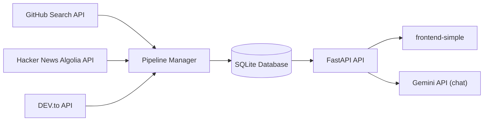

# TrendIntel

TrendIntel is a developer trend intelligence project that gathers signals from GitHub, Hacker News, and DEV.to, stores them in a local SQLite database, ranks repositories with a composite score, and serves the results through a FastAPI backend and a lightweight frontend.

It is built for questions like:

- Which repositories are getting the most attention this week?
- Which languages and topics are showing momentum?
- Which articles and Hacker News stories are driving interest?
- What related repositories should I explore next?

## Table of Contents

- [Overview](#overview)
- [Feature Set](#feature-set)
- [How It Works](#how-it-works)
- [Architecture](#architecture)
- [Tech Stack](#tech-stack)
- [Project Structure](#project-structure)
- [Quick Start](#quick-start)
- [Environment Variables](#environment-variables)
- [Running the Project](#running-the-project)
- [API Reference](#api-reference)
- [Ranking Logic](#ranking-logic)
- [Frontend Pages](#frontend-pages)
- [Troubleshooting](#troubleshooting)
- [Current Limitations](#current-limitations)
- [License](#license)

## Overview

TrendIntel turns scattered developer signals into a single local intelligence dashboard.

The backend:

- fetches trending repositories from GitHub
- fetches recent Hacker News stories that mention GitHub repositories
- fetches recent DEV.to articles and extracts linked GitHub repositories
- merges everything into a repo-centric dataset
- computes a weighted trending score
- exposes analytics, search, recommendations, and AI chat endpoints

The frontend provides five simple views:

- Dashboard
- Trending GitHub Repositories
- Hacker News Stories
- DEV.to Articles
- AI Chat

## Feature Set

- Unified trend tracking across GitHub, Hacker News, and DEV.to
- Composite repository scoring using stars, cross-source mentions, and recency
- Automatic hourly refresh using APScheduler
- Local SQLite persistence for repositories, mentions, snapshots, articles, and topics
- Searchable trending repository list
- TF-IDF based repository recommendations
- Analytics summary for languages, topics, source breakdown, and mention counts
- Gemini-powered chat grounded in the latest fetched data
- Lightweight frontend with dark/light theme toggle

## How It Works

### 1. Data collection

The pipeline fetches:

- GitHub repositories pushed in the last 14 days with more than 500 stars
- Hacker News stories from the last 7 days that contain GitHub links and have more than 10 points
- DEV.to top articles from the last 7 days, with low-signal tags filtered out

### 2. Entity linking

Repository slugs such as `owner/repo` are extracted from:

- Hacker News story URLs and titles
- DEV.to titles, descriptions, and article bodies

If a repository appears in Hacker News or DEV.to but is not already in the GitHub search results, the backend attempts to fetch its metadata directly from the GitHub API.

### 3. Storage

The project stores data locally in SQLite using SQLModel models for:

- `Repo`
- `Snapshot`
- `HNStory`
- `DevArticle`
- `Mention`
- `Topic`

### 4. Analytics and chat

The API exposes:

- ranked repositories
- source-specific trend views
- analytics summaries
- similar repository recommendations
- AI summaries through Gemini

## Architecture



## Tech Stack

| Layer | Tools |
| --- | --- |
| Backend API | FastAPI, Uvicorn |
| Data models and DB | SQLModel, SQLite |
| Scheduling | APScheduler |
| Data fetching | Requests |
| Recommendations | scikit-learn TF-IDF + cosine similarity |
| AI | `google-genai` |
| Frontend | HTML, CSS, vanilla JavaScript |

## Project Structure

```text
trend-intel/
|-- backend/
|   |-- api/
|   |   `-- main.py
|   |-- pipeline/
|   |   |-- database.py
|   |   |-- dev_fetcher.py
|   |   |-- github_fetcher.py
|   |   |-- hacker_news_fetcher.py
|   |   |-- models.py
|   |   |-- pipeline_manager.py
|   |   `-- scheduler.py
|   |-- database/
|   |   `-- trend_intel.db
|   |-- pyproject.toml
|   |-- requirements.txt
|   `-- setup.cfg
|-- frontend-simple/
|   |-- app.js
|   |-- articles.html
|   |-- chat.html
|   |-- hn.html
|   |-- index.html
|   |-- repos.html
|   `-- style.css
|-- docs/
|-- docker-compose.yml
`-- README.md
```

## Quick Start

### Prerequisites

- Python 3.11 or newer
- Internet access for GitHub, Hacker News, DEV.to, and Gemini API calls
- A Gemini API key if you want the AI chat screen to work

Note:

- The active frontend in this repository is `frontend-simple/`
- You do not need a Node.js build step to run the current frontend
- `docker-compose.yml` exists but is currently empty, so Docker startup is not yet configured

### 1. Install backend dependencies

```bash
cd backend
python -m venv .venv
```

Activate the virtual environment:

```bash
# PowerShell
.\.venv\Scripts\Activate.ps1
```

```bash
# macOS / Linux
source .venv/bin/activate
```

Install packages:

```bash
pip install -r requirements.txt
```

### 2. Create the environment file

Create `backend/.env` and add the variables you need:

```env
GEMINI_API_KEY=your_gemini_api_key
GITHUB_TOKEN=your_github_token
DATABASE_URL=sqlite:///./database/trend_intel.db
```

Only `GEMINI_API_KEY` is required for AI chat.

`GITHUB_TOKEN` is strongly recommended to reduce GitHub API rate-limit issues.

`DATABASE_URL` is optional. If you omit it, the app stores data in `backend/database/trend_intel.db`.

### 3. Start the backend

From the `backend/` directory:

```bash
uvicorn api.main:app --reload
```

When the API starts, it automatically:

- creates the database tables
- runs the data pipeline once
- starts the hourly scheduler

The first startup may take a little longer because the initial data pull happens during app startup.

### 4. Start the frontend

Recommended option:

```bash
cd frontend-simple
python -m http.server 5500
```

Then open:

- `http://localhost:5500`

The frontend expects the API to be available at:

- `http://localhost:8000`

If you want to use a different backend URL, update `frontend-simple/app.js` and change the `API_BASE` constant.

## Environment Variables

| Variable | Required | Purpose | Default |
| --- | --- | --- | --- |
| `GEMINI_API_KEY` | Only for chat | Enables `POST /api/chat` | None |
| `GITHUB_TOKEN` | Recommended | Increases GitHub API quota | None |
| `DATABASE_URL` | No | Overrides SQLite connection string | local SQLite DB in `backend/database/trend_intel.db` |

## Running the Project

### Backend only

```bash
cd backend
uvicorn api.main:app --reload
```

### Manual pipeline refresh

If you want to trigger a refresh without waiting for the next hourly scheduler run:

```bash
cd backend
python -m pipeline.pipeline_manager
```

### API documentation

Once the backend is running, FastAPI provides interactive docs at:

- `http://localhost:8000/docs`

## API Reference

| Method | Endpoint | Description |
| --- | --- | --- |
| `GET` | `/trending` | Returns trending repositories ordered by `trending_score` |
| `GET` | `/trends/hn` | Returns top Hacker News stories |
| `GET` | `/trends/devto` | Returns top DEV.to articles |
| `GET` | `/search` | Searches repositories by name |
| `GET` | `/recommend/{repo_id}` | Returns similar repositories using TF-IDF |
| `GET` | `/analytics` | Returns aggregate analytics and leaderboard data |
| `POST` | `/api/chat` | Sends a trend question to Gemini with live project context |

### Supported query parameters

| Endpoint | Parameters |
| --- | --- |
| `/trending` | `limit`, `language` |
| `/trends/hn` | `limit` |
| `/trends/devto` | `limit`, `tag` |
| `/search` | `q` |
| `/recommend/{repo_id}` | `limit` |

### Example requests

```bash
curl "http://localhost:8000/trending?limit=10"
curl "http://localhost:8000/trending?language=Python"
curl "http://localhost:8000/search?q=agent"
curl "http://localhost:8000/analytics"
```

Chat request example:

```bash
curl -X POST "http://localhost:8000/api/chat" \
  -H "Content-Type: application/json" \
  -d "{\"query\":\"Summarize the biggest developer trends this week\"}"
```

## Ranking Logic

Repositories are scored in `backend/pipeline/pipeline_manager.py` using:

```text
star_score = log1p(stars) * 10
mention_score = (hn_mentions * 50) + (dev_mentions * 30)
recency_bonus = 10 if first_seen_within_last_7_days else 0
trending_score = round(star_score + (mention_score * 3) + recency_bonus, 2)
```

The pipeline also filters out noisy repository patterns such as:

- awesome lists
- roadmaps
- book collections
- interview or curriculum style repositories

This keeps the ranking focused on actively discussed projects instead of generic resource lists.

## Frontend Pages

### Dashboard

Shows:

- total repositories
- mention counts from Hacker News and DEV.to
- topic counts
- top languages
- top topics

### GitHub Repositories

Shows:

- repository name
- description
- language
- star count
- computed trend score

Includes client-side search.

### Hacker News

Shows:

- story title
- points
- author
- outbound story link

Includes client-side search.

### DEV.to Articles

Shows:

- article title
- reaction count
- tags
- outbound article link

Includes client-side search.

### AI Chat

Lets you ask questions about:

- trending repositories
- emerging topics
- language momentum
- cross-source summaries

The chat endpoint builds context from the latest top repositories, top Hacker News stories, and top DEV.to articles before sending the prompt to Gemini.

## Troubleshooting

### The frontend loads but shows errors

Make sure:

- the backend is running on `http://localhost:8000`
- the API finished its first startup pipeline run
- your browser can reach the backend from the frontend page

### AI chat returns a 500 error

Most likely causes:

- `GEMINI_API_KEY` is missing
- the Gemini API key is invalid
- the Gemini API request failed upstream

### GitHub results are empty or incomplete

Possible reasons:

- GitHub API rate limits
- temporary network failure
- no `GITHUB_TOKEN` configured

### Data looks stale

The scheduler refreshes data every 1 hour. You can also run:

```bash
cd backend
python -m pipeline.pipeline_manager
```

### Docker does not work

That is expected in the current repository state. `docker-compose.yml` is present but empty, so containerized startup has not been implemented yet.

## Current Limitations

- No automated test suite is included yet
- No production deployment configuration is included yet
- The current UI is a static multi-page frontend, not a bundled SPA
- SQLite is local-only and best suited for development or single-user usage
- CORS is fully open for local development and should be restricted before production use

## License

No license file is included in the repository right now. Add a license before public distribution if you plan to open-source or share the project broadly.
